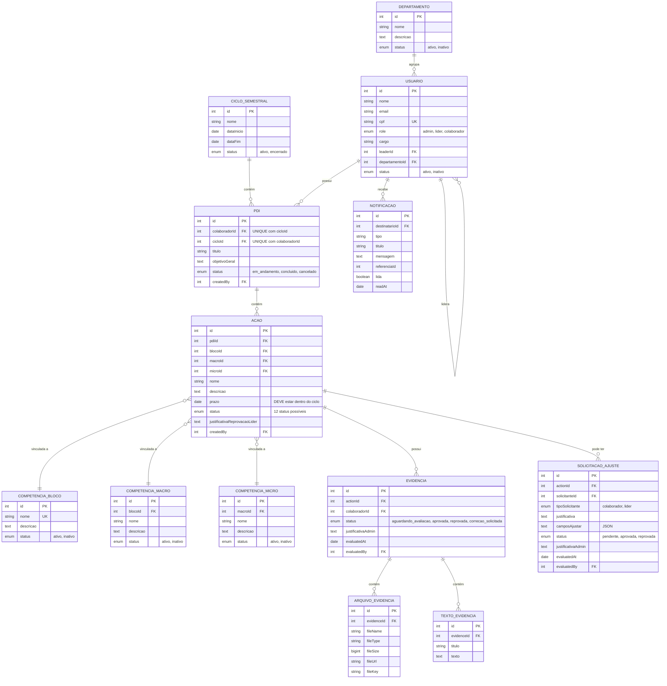

# 🏗️ Arquitetura do Sistema de Gestão de PDI

## 📊 Diagrama de Entidades e Relacionamentos



---

## 🔑 Regras de Negócio Fundamentais

### **1. Unicidade de PDI**
**Regra:** 1 PDI por colaborador por ciclo (constraint UNIQUE)

```sql
UNIQUE INDEX idx_pdi_colaborador_ciclo ON pdis(colaboradorId, cicloId)
```

**Validação:**
- Ao criar PDI, verificar se já existe PDI para aquele colaborador naquele ciclo
- Se existir, retornar erro: "Colaborador já possui PDI neste ciclo"

### **2. Hierarquia de Usuários**
**Regra:** Líder e Colaborador DEVEM ter líder e departamento

```
Admin (sem líder, sem departamento)
  └── Líder (TEM líder, TEM departamento)
       └── Colaborador (TEM líder, TEM departamento)
```

**Validação:**
- Líder e Colaborador: `leaderId` e `departamentoId` obrigatórios
- Admin: `leaderId` e `departamentoId` opcionais (NULL)
- Usuário e seu líder DEVEM estar no mesmo departamento

### **3. Hierarquia de Competências**
**Regra:** Bloco → Macro → Micro (cascata)

```
Bloco: Liderança
  └── Macro: Gestão de Pessoas
       └── Micro: Resolução de Conflitos
```

**Validação:**
- Macro DEVE pertencer a um Bloco
- Micro DEVE pertencer a uma Macro
- Ao criar ação, validar hierarquia completa

### **4. Prazo de Ação Dentro do Ciclo**
**Regra:** `acao.prazo` DEVE estar entre `ciclo.dataInicio` e `ciclo.dataFim`

```typescript
if (acao.prazo < ciclo.dataInicio || acao.prazo > ciclo.dataFim) {
  throw new Error("Prazo deve estar dentro do período do ciclo");
}
```

**Validação:**
- Frontend: DatePicker com min/max baseado no ciclo
- Backend: Validação dupla ao criar/editar ação

### **5. Status do PDI Calculado Automaticamente**
**Regra:** Admin NÃO pode alterar status do PDI manualmente

```typescript
function calcularStatusPDI(pdiId) {
  const acoes = getAcoesByPDI(pdiId);
  
  if (acoes.length === 0) return "em_andamento";
  
  const todasConcluidas = acoes.every(a => a.status === "concluida");
  return todasConcluidas ? "concluido" : "em_andamento";
}
```

**Quando recalcular:**
- Após Admin aprovar evidências de uma ação
- Após Admin marcar ação como concluída
- Após Admin cancelar uma ação

### **6. Notificações Automáticas**
**Regra:** Sistema envia notificações em eventos-chave

| Evento | Destinatário | Tipo |
|--------|--------------|------|
| Ação criada | Líder | `nova_acao` |
| Ação aprovada por Líder | Colaborador | `acao_aprovada` |
| Ação reprovada por Líder | Admin | `acao_reprovada` |
| Evidência enviada | Admin | `evidencia_enviada` |
| Evidência aprovada | Colaborador | `evidencia_aprovada` |
| Evidência reprovada | Colaborador | `evidencia_reprovada` |
| PDI concluído | Colaborador | `pdi_concluido` |
| Ação próxima do vencimento (7 dias) | Colaborador + Líder | `acao_proxima_vencimento` |
| Ação vencida | Colaborador + Líder + Admin | `acao_vencida` |

---

## 📦 Estrutura de Pastas do Projeto

```
pdi_system/
├── client/                      # Frontend React
│   ├── src/
│   │   ├── pages/              # Páginas principais
│   │   │   ├── Home.tsx        # Dashboard inicial
│   │   │   ├── Users.tsx       # Gestão de usuários
│   │   │   ├── Departamentos.tsx  # Gestão de departamentos
│   │   │   ├── Competencias.tsx   # Gestão de competências
│   │   │   ├── Ciclos.tsx      # Gestão de ciclos
│   │   │   ├── PDIs.tsx        # 🔜 Gestão de PDIs
│   │   │   ├── Acoes.tsx       # 🔜 Gestão de ações
│   │   │   ├── Aprovacoes.tsx  # 🔜 Interface de aprovação (Líder)
│   │   │   ├── MeuPDI.tsx      # 🔜 Interface de execução (Colaborador)
│   │   │   └── Avaliacoes.tsx  # 🔜 Avaliação de evidências (Admin)
│   │   ├── components/         # Componentes reutilizáveis
│   │   │   ├── ui/             # shadcn/ui components
│   │   │   ├── DashboardLayout.tsx  # Layout principal
│   │   │   └── AIChatBox.tsx   # Chat com IA (para sugestões)
│   │   ├── lib/
│   │   │   └── trpc.ts         # Cliente tRPC
│   │   └── App.tsx             # Roteamento
│   └── public/                 # Assets estáticos
├── server/                      # Backend Node.js + tRPC
│   ├── routers.ts              # Procedures tRPC
│   ├── db.ts                   # Funções de banco de dados
│   ├── _core/                  # Infraestrutura
│   │   ├── llm.ts              # Integração com IA
│   │   ├── notification.ts     # Sistema de notificações
│   │   └── customTrpc.ts       # Middlewares de autenticação
│   └── storage.ts              # Upload S3 para evidências
├── drizzle/                     # ORM e migrações
│   └── schema.ts               # Schema completo do banco
└── shared/                      # Tipos compartilhados
```

---

## 🔄 Fluxo de Dados

### **Criação de PDI:**
```
Admin (Frontend)
  → trpc.pdis.create({ colaboradorId, cicloId, titulo, objetivoGeral })
    → Backend valida unicidade
      → db.createPDI()
        → Banco de dados (MySQL/TiDB)
          → Retorna PDI criado
            → Frontend redireciona para /pdis/[id]
```

### **Criação de Ação com IA:**
```
Admin (Frontend)
  → Seleciona Bloco, Macro, Micro
    → Clica "✨ Sugerir com IA"
      → trpc.actions.suggestAction({ blocoId, macroId, microId })
        → Backend chama invokeLLM()
          → IA retorna { nome, descricao }
            → Frontend preenche campos
              → Admin ajusta se necessário
                → trpc.actions.create({ pdiId, ..., nome, descricao, prazo })
                  → Backend valida prazo dentro do ciclo
                    → db.createAction()
                      → Banco de dados
                        → Notificação para Líder
                          → Frontend exibe toast de sucesso
```

### **Aprovação de Evidências com Recálculo:**
```
Admin (Frontend)
  → Visualiza evidências enviadas
    → Clica "✅ Aprovar Evidências"
      → trpc.actions.approveEvidence({ acaoId })
        → Backend:
          1. Atualiza ação: status = "concluida"
          2. Busca todas as ações do PDI
          3. Verifica se todas estão concluídas
          4. Se sim: atualiza PDI: status = "concluido"
          5. Envia notificação para colaborador
        → Frontend:
          - Atualiza lista de ações
          - Atualiza status do PDI
          - Exibe toast: "Evidência aprovada!"
```

---

## 🎯 Próximos Passos

1. ✅ Arquitetura documentada
2. 🔜 Fluxograma de status de ações (próximo documento)
3. 🔜 Impacto de cada status no PDI e ciclo (próximo documento)
4. 🔜 Implementação do backend (validações + recálculo)
5. 🔜 Implementação do frontend (FASE 1: PDIs)
