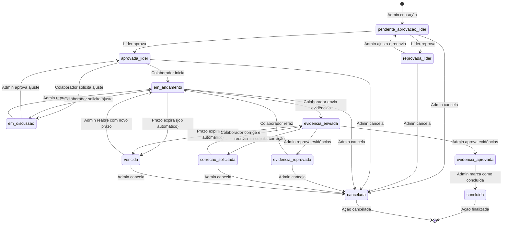

# 🔄 Fluxograma Completo de Status de Ações

## 📊 Diagrama de Transição de Status

---

## 📋 Detalhamento dos 12 Status

### **1. pendente_aprovacao_lider** 🟠
**Descrição:** Ação foi criada pelo Admin e aguarda aprovação do Líder

**Quem pode ver:**
- ✅ Admin (criador)
- ✅ Líder (aprovador)
- ❌ Colaborador (ainda não)

**Ações disponíveis:**
- **Líder:** Aprovar ou Reprovar
- **Admin:** Editar ou Cancelar

**Transições possíveis:**
- → `aprovada_lider` (Líder aprova)
- → `reprovada_lider` (Líder reprova)
- → `cancelada` (Admin cancela)

**Notificações:**
- Líder recebe: "Nova ação criada para seu liderado [Nome]"

---

### **2. aprovada_lider** ✅
**Descrição:** Líder aprovou a ação, colaborador pode iniciar execução

**Quem pode ver:**
- ✅ Admin
- ✅ Líder
- ✅ Colaborador (agora pode ver)

**Ações disponíveis:**
- **Colaborador:** Iniciar execução ou Solicitar ajuste
- **Admin:** Editar ou Cancelar

**Transições possíveis:**
- → `em_andamento` (Colaborador inicia)
- → `em_discussao` (Colaborador solicita ajuste)
- → `cancelada` (Admin cancela)

**Notificações:**
- Colaborador recebe: "Ação aprovada! Você pode iniciar a execução."

---

### **3. reprovada_lider** ❌
**Descrição:** Líder reprovou a ação, Admin precisa ajustar

**Quem pode ver:**
- ✅ Admin
- ✅ Líder
- ❌ Colaborador (não vê ações reprovadas)

**Ações disponíveis:**
- **Admin:** Ajustar e reenviar para aprovação ou Cancelar
- **Líder:** Apenas visualizar justificativa

**Transições possíveis:**
- → `pendente_aprovacao_lider` (Admin ajusta e reenvia)
- → `cancelada` (Admin cancela)

**Notificações:**
- Admin recebe: "Ação reprovada pelo líder. Justificativa: [texto]"

**Dados adicionais:**
- `justificativaReprovacaoLider`: texto obrigatório do líder

---

### **4. em_andamento** 🔵
**Descrição:** Colaborador iniciou a execução da ação

**Quem pode ver:**
- ✅ Admin
- ✅ Líder
- ✅ Colaborador

**Ações disponíveis:**
- **Colaborador:** Enviar evidências ou Solicitar ajuste
- **Admin:** Editar prazo ou Cancelar

**Transições possíveis:**
- → `evidencia_enviada` (Colaborador envia evidências)
- → `em_discussao` (Colaborador solicita ajuste)
- → `vencida` (Prazo expira - job automático)
- → `cancelada` (Admin cancela)

**Notificações:**
- Líder recebe: "Colaborador [Nome] iniciou a ação [Ação]"

**Alertas automáticos:**
- **7 dias antes do prazo:** Notificação para Colaborador e Líder
- **No dia do prazo:** Notificação urgente

---

### **5. em_discussao** 💬
**Descrição:** Colaborador solicitou ajuste na ação (prazo, descrição, etc.)

**Quem pode ver:**
- ✅ Admin
- ✅ Líder (apenas visualiza)
- ✅ Colaborador

**Ações disponíveis:**
- **Admin:** Aprovar ajuste ou Reprovar ajuste
- **Colaborador:** Apenas aguardar

**Transições possíveis:**
- → `aprovada_lider` (Admin aprova ajuste)
- → `em_andamento` (Admin reprova ajuste)

**Notificações:**
- Admin recebe: "Colaborador solicitou ajuste. Justificativa: [texto]"

**Dados adicionais:**
- `solicitacaoAjuste`: { justificativa, camposAjustar, tipoSolicitante }

---

### **6. evidencia_enviada** 📎
**Descrição:** Colaborador enviou evidências para avaliação do Admin

**Quem pode ver:**
- ✅ Admin (avaliador)
- ✅ Líder (apenas visualiza)
- ✅ Colaborador

**Ações disponíveis:**
- **Admin:** Aprovar, Reprovar ou Solicitar correção
- **Colaborador:** Apenas aguardar

**Transições possíveis:**
- → `evidencia_aprovada` (Admin aprova)
- → `evidencia_reprovada` (Admin reprova)
- → `correcao_solicitada` (Admin solicita correção)
- → `vencida` (Prazo expira - job automático)

**Notificações:**
- Admin recebe: "Colaborador enviou evidências para avaliação"

**Dados adicionais:**
- `evidencias`: [ { arquivos, textos } ]

---

### **7. evidencia_aprovada** ✅
**Descrição:** Admin aprovou as evidências (status intermediário)

**Quem pode ver:**
- ✅ Admin
- ✅ Líder
- ✅ Colaborador

**Ações disponíveis:**
- **Admin:** Marcar como concluída

**Transições possíveis:**
- → `concluida` (Admin marca como concluída)

**Notificações:**
- Colaborador recebe: "Suas evidências foram aprovadas!"

**Observação:**
- Este é um status intermediário antes da conclusão final
- Admin pode querer aguardar outras validações antes de concluir

---

### **8. evidencia_reprovada** ❌
**Descrição:** Admin reprovou as evidências enviadas

**Quem pode ver:**
- ✅ Admin
- ✅ Líder
- ✅ Colaborador

**Ações disponíveis:**
- **Colaborador:** Refazer evidências
- **Admin:** Cancelar ação

**Transições possíveis:**
- → `em_andamento` (Colaborador refaz)
- → `cancelada` (Admin cancela)

**Notificações:**
- Colaborador recebe: "Evidências reprovadas. Justificativa: [texto]"

**Dados adicionais:**
- `justificativaAdmin`: texto obrigatório explicando reprovação

---

### **9. correcao_solicitada** 🔄
**Descrição:** Admin solicitou correção nas evidências

**Quem pode ver:**
- ✅ Admin
- ✅ Líder
- ✅ Colaborador

**Ações disponíveis:**
- **Colaborador:** Corrigir e reenviar evidências
- **Admin:** Cancelar ação

**Transições possíveis:**
- → `evidencia_enviada` (Colaborador corrige e reenvia)
- → `cancelada` (Admin cancela)

**Notificações:**
- Colaborador recebe: "Correção solicitada. Orientações: [texto]"

**Dados adicionais:**
- `justificativaAdmin`: texto obrigatório com orientações

**Diferença de `evidencia_reprovada`:**
- `reprovada`: Evidências inadequadas, refazer do zero
- `correcao_solicitada`: Evidências quase boas, apenas ajustar

---

### **10. concluida** 🎉
**Descrição:** Ação finalizada com sucesso (evidências aprovadas)

**Quem pode ver:**
- ✅ Admin
- ✅ Líder
- ✅ Colaborador

**Ações disponíveis:**
- Nenhuma (status final)

**Transições possíveis:**
- Nenhuma (estado final)

**Notificações:**
- Colaborador recebe: "Ação concluída com sucesso! 🎉"
- **Se todas as ações do PDI foram concluídas:**
  - Colaborador recebe: "PDI concluído! Parabéns! 🎉🎉🎉"

**Impacto no PDI:**
- Sistema recalcula status do PDI
- Se todas as ações estão `concluida` → PDI status = `concluido`

---

### **11. vencida** ⏰
**Descrição:** Prazo da ação expirou sem conclusão (job automático)

**Quem pode ver:**
- ✅ Admin
- ✅ Líder
- ✅ Colaborador

**Ações disponíveis:**
- **Admin:** Reabrir com novo prazo ou Cancelar

**Transições possíveis:**
- → `em_andamento` (Admin reabre com novo prazo)
- → `cancelada` (Admin cancela)

**Notificações:**
- Colaborador recebe: "Ação vencida! Entre em contato com seu líder."
- Líder recebe: "Ação do colaborador [Nome] venceu."
- Admin recebe: "Ação vencida: [Ação]"

**Job automático:**
- Roda diariamente às 00:00
- Verifica ações com `prazo < hoje` e status `em_andamento` ou `evidencia_enviada`
- Atualiza para `vencida`

**Impacto no PDI:**
- PDI permanece `em_andamento` (ações vencidas não impedem conclusão)
- Admin pode reabrir ou cancelar

---

### **12. cancelada** 🚫
**Descrição:** Ação foi cancelada pelo Admin

**Quem pode ver:**
- ✅ Admin
- ✅ Líder
- ✅ Colaborador

**Ações disponíveis:**
- Nenhuma (status final)

**Transições possíveis:**
- Nenhuma (estado final)

**Notificações:**
- Colaborador recebe: "Ação cancelada. Motivo: [texto]"
- Líder recebe: "Ação do colaborador [Nome] foi cancelada."

**Dados adicionais:**
- `justificativaCancelamento`: texto obrigatório do Admin

**Impacto no PDI:**
- Ações canceladas não contam para conclusão do PDI
- Se todas as ações restantes estão `concluida` → PDI pode ser concluído

---

## 🎯 Resumo de Transições por Ator

### **Admin (Criador e Avaliador)**
- Cria ação → `pendente_aprovacao_lider`
- Ajusta ação reprovada → `pendente_aprovacao_lider`
- Aprova ajuste solicitado → `aprovada_lider`
- Aprova evidências → `evidencia_aprovada` → `concluida`
- Reprova evidências → `evidencia_reprovada`
- Solicita correção → `correcao_solicitada`
- Reabre ação vencida → `em_andamento`
- Cancela ação → `cancelada`

### **Líder (Aprovador)**
- Aprova ação → `aprovada_lider`
- Reprova ação → `reprovada_lider`

### **Colaborador (Executor)**
- Inicia ação → `em_andamento`
- Solicita ajuste → `em_discussao`
- Envia evidências → `evidencia_enviada`
- Corrige evidências → `evidencia_enviada`
- Refaz após reprovação → `em_andamento`

### **Sistema (Automático)**
- Prazo expira → `vencida`
- Alerta 7 dias antes → Notificação
- Recalcula status do PDI → `concluido` (se todas as ações concluídas)

---

## 📊 Estatísticas de Status

### **Contagem de Ações por Status (Exemplo)**
| Status | Quantidade | % |
|--------|------------|---|
| `em_andamento` | 15 | 30% |
| `evidencia_enviada` | 8 | 16% |
| `concluida` | 20 | 40% |
| `pendente_aprovacao_lider` | 5 | 10% |
| `vencida` | 2 | 4% |
| **Total** | **50** | **100%** |

### **Tempo Médio por Status**
| Status | Tempo Médio |
|--------|-------------|
| `pendente_aprovacao_lider` | 2 dias |
| `em_andamento` | 30 dias |
| `evidencia_enviada` | 5 dias |
| `evidencia_aprovada` | 1 dia |

---

## 🔔 Matriz de Notificações

| Evento | Admin | Líder | Colaborador |
|--------|-------|-------|-------------|
| Ação criada | - | ✅ | - |
| Ação aprovada | - | - | ✅ |
| Ação reprovada | ✅ | - | - |
| Ação iniciada | - | ✅ | - |
| Ajuste solicitado | ✅ | ℹ️ | - |
| Evidência enviada | ✅ | ℹ️ | - |
| Evidência aprovada | - | ℹ️ | ✅ |
| Evidência reprovada | - | ℹ️ | ✅ |
| Correção solicitada | - | ℹ️ | ✅ |
| Ação concluída | ℹ️ | ℹ️ | ✅ |
| Ação vencida | ✅ | ✅ | ✅ |
| Ação cancelada | - | ✅ | ✅ |
| PDI concluído | ℹ️ | ℹ️ | ✅ |
| Alerta 7 dias | - | ✅ | ✅ |

**Legenda:**
- ✅ Notificação principal (ação requerida)
- ℹ️ Notificação informativa (apenas ciência)
- `-` Sem notificação

---

## 🎨 Cores e Ícones por Status

| Status | Cor | Ícone | Badge |
|--------|-----|-------|-------|
| `pendente_aprovacao_lider` | 🟠 Laranja (#F59E0B) | ⏳ | Aguardando Líder |
| `aprovada_lider` | 🟢 Verde Claro (#34D399) | ✅ | Aprovada |
| `reprovada_lider` | 🔴 Vermelho (#EF4444) | ❌ | Reprovada |
| `em_andamento` | 🔵 Azul (#3B82F6) | ▶️ | Em Andamento |
| `em_discussao` | 🟣 Roxo (#8B5CF6) | 💬 | Em Discussão |
| `evidencia_enviada` | 🟣 Roxo (#8B5CF6) | 📎 | Evidência Enviada |
| `evidencia_aprovada` | 🟢 Verde (#10B981) | ✅ | Evidência Aprovada |
| `evidencia_reprovada` | 🔴 Vermelho (#EF4444) | ❌ | Evidência Reprovada |
| `correcao_solicitada` | 🟡 Amarelo (#FBBF24) | 🔄 | Correção Solicitada |
| `concluida` | 🟢 Verde Escuro (#059669) | 🎉 | Concluída |
| `vencida` | ⚫ Cinza Escuro (#374151) | ⏰ | Vencida |
| `cancelada` | ⚪ Cinza (#6B7280) | 🚫 | Cancelada |

---

## 📈 Próximo Documento

**IMPACTO_STATUS_PDI_CICLO.md** - Explicação detalhada de como cada status afeta o PDI e o ciclo de desenvolvimento
