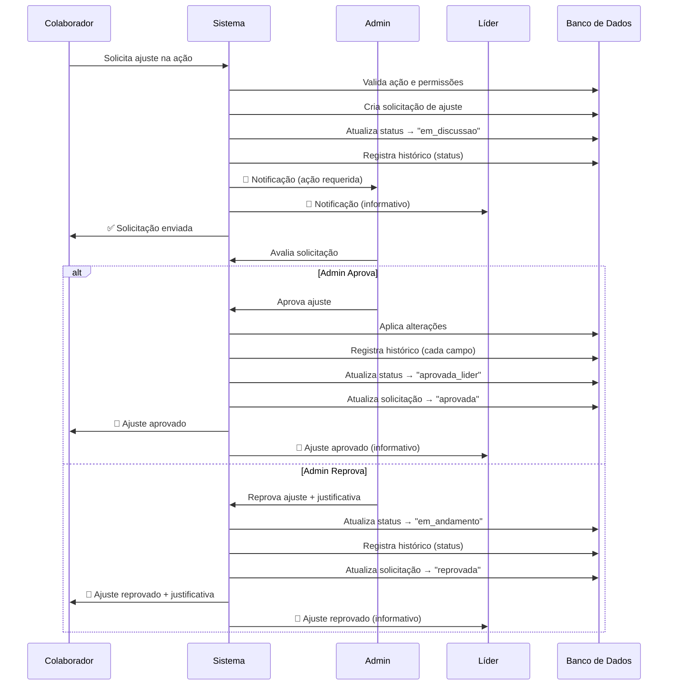

# 🔄 Sistema de Solicitação de Ajuste de Ações - Implementação Completa

## 📋 Visão Geral

Este documento detalha a implementação completa do sistema de solicitação de ajuste de ações, incluindo:
- ✅ Tabela `acoes_historico` criada no schema
- ✅ Procedures tRPC para solicitar, aprovar e reprovar ajustes
- ✅ Sistema de notificações para Admin e Líder
- ✅ Registro automático de histórico de alterações

---

## 🗄️ 1. Tabela `acoes_historico` (Schema)

### **Estrutura:**
```typescript
export const acoesHistorico = mysqlTable("acoes_historico", {
  id: int("id").autoincrement().primaryKey(),
  actionId: int("actionId").notNull(),
  campo: varchar("campo", { length: 50 }).notNull(), // nome, descricao, prazo, status, etc.
  valorAnterior: text("valorAnterior"),
  valorNovo: text("valorNovo"),
  motivoAlteracao: text("motivoAlteracao"),
  alteradoPor: int("alteradoPor").notNull(), // Admin que fez a alteração
  solicitacaoAjusteId: int("solicitacaoAjusteId"), // Se foi por solicitação
  createdAt: timestamp("createdAt").defaultNow().notNull(),
});
```

### **Campos Rastreados:**
- `nome` - Nome da ação
- `descricao` - Descrição da ação
- `prazo` - Prazo de conclusão
- `status` - Status da ação
- `blocoId` - Bloco de competência
- `macroId` - Macro competência
- `microId` - Micro competência

### **Exemplo de Registro:**
```json
{
  "id": 1,
  "actionId": 42,
  "campo": "prazo",
  "valorAnterior": "2024-03-31",
  "valorNovo": "2024-04-15",
  "motivoAlteracao": "Colaborador solicitou extensão de prazo devido a complexidade do projeto",
  "alteradoPor": 1,
  "solicitacaoAjusteId": 5,
  "createdAt": "2024-01-15 10:30:00"
}
```

---

## 🔧 2. Procedures tRPC

### **2.1. Colaborador Solicita Ajuste**

```typescript
// server/routers.ts
acoes: {
  solicitarAjuste: protectedProcedure
    .input(z.object({
      actionId: z.number(),
      justificativa: z.string().min(10),
      camposAjustar: z.object({
        nome: z.string().optional(),
        descricao: z.string().optional(),
        prazo: z.string().optional(), // ISO date string
        blocoId: z.number().optional(),
        macroId: z.number().optional(),
        microId: z.number().optional(),
      }),
    }))
    .mutation(async ({ ctx, input }) => {
      // 1. Verificar se a ação existe e pertence ao colaborador
      const acao = await db.getActionById(input.actionId);
      if (!acao) {
        throw new TRPCError({ code: 'NOT_FOUND', message: 'Ação não encontrada' });
      }

      const pdi = await db.getPDIById(acao.pdiId);
      if (pdi.colaboradorId !== ctx.user.id) {
        throw new TRPCError({ code: 'FORBIDDEN', message: 'Você não tem permissão para solicitar ajuste nesta ação' });
      }

      // 2. Verificar se ação está em status válido para solicitação
      const statusValidos = ['aprovada_lider', 'em_andamento'];
      if (!statusValidos.includes(acao.status)) {
        throw new TRPCError({ 
          code: 'BAD_REQUEST', 
          message: 'Ação não está em status válido para solicitação de ajuste' 
        });
      }

      // 3. Criar solicitação de ajuste
      const solicitacao = await db.createAdjustmentRequest({
        actionId: input.actionId,
        solicitanteId: ctx.user.id,
        tipoSolicitante: 'colaborador',
        justificativa: input.justificativa,
        camposAjustar: JSON.stringify(input.camposAjustar),
        status: 'pendente',
      });

      // 4. Atualizar status da ação para "em_discussao"
      await db.updateActionStatus(input.actionId, 'em_discussao');

      // 5. Registrar no histórico
      await db.createAcaoHistorico({
        actionId: input.actionId,
        campo: 'status',
        valorAnterior: acao.status,
        valorNovo: 'em_discussao',
        motivoAlteracao: `Colaborador solicitou ajuste: ${input.justificativa}`,
        alteradoPor: ctx.user.id,
        solicitacaoAjusteId: solicitacao.id,
      });

      // 6. Notificar Admin
      await db.createNotification({
        destinatarioId: acao.createdBy, // Admin que criou a ação
        tipo: 'solicitacao_ajuste',
        titulo: '🔄 Solicitação de Ajuste de Ação',
        mensagem: `${ctx.user.name} solicitou ajuste na ação "${acao.nome}". Justificativa: ${input.justificativa}`,
        referenciaId: input.actionId,
      });

      // 7. Notificar Líder (informativo)
      await db.createNotification({
        destinatarioId: pdi.liderId,
        tipo: 'solicitacao_ajuste_info',
        titulo: 'ℹ️ Solicitação de Ajuste (Informativo)',
        mensagem: `Seu liderado ${ctx.user.name} solicitou ajuste na ação "${acao.nome}".`,
        referenciaId: input.actionId,
      });

      return { success: true, solicitacaoId: solicitacao.id };
    }),
}
```

### **2.2. Admin Aprova Ajuste**

```typescript
acoes: {
  aprovarAjuste: protectedProcedure
    .input(z.object({
      solicitacaoId: z.number(),
    }))
    .mutation(async ({ ctx, input }) => {
      // 1. Verificar se usuário é Admin
      if (ctx.user.role !== 'admin') {
        throw new TRPCError({ code: 'FORBIDDEN', message: 'Apenas Admin pode aprovar ajustes' });
      }

      // 2. Buscar solicitação
      const solicitacao = await db.getAdjustmentRequestById(input.solicitacaoId);
      if (!solicitacao) {
        throw new TRPCError({ code: 'NOT_FOUND', message: 'Solicitação não encontrada' });
      }

      if (solicitacao.status !== 'pendente') {
        throw new TRPCError({ code: 'BAD_REQUEST', message: 'Solicitação já foi avaliada' });
      }

      // 3. Buscar ação
      const acao = await db.getActionById(solicitacao.actionId);
      const camposAjustar = JSON.parse(solicitacao.camposAjustar);

      // 4. Aplicar alterações e registrar histórico
      const updates: any = {};
      
      if (camposAjustar.nome) {
        await db.createAcaoHistorico({
          actionId: acao.id,
          campo: 'nome',
          valorAnterior: acao.nome,
          valorNovo: camposAjustar.nome,
          motivoAlteracao: `Ajuste aprovado. Justificativa: ${solicitacao.justificativa}`,
          alteradoPor: ctx.user.id,
          solicitacaoAjusteId: solicitacao.id,
        });
        updates.nome = camposAjustar.nome;
      }

      if (camposAjustar.descricao) {
        await db.createAcaoHistorico({
          actionId: acao.id,
          campo: 'descricao',
          valorAnterior: acao.descricao,
          valorNovo: camposAjustar.descricao,
          motivoAlteracao: `Ajuste aprovado. Justificativa: ${solicitacao.justificativa}`,
          alteradoPor: ctx.user.id,
          solicitacaoAjusteId: solicitacao.id,
        });
        updates.descricao = camposAjustar.descricao;
      }

      if (camposAjustar.prazo) {
        await db.createAcaoHistorico({
          actionId: acao.id,
          campo: 'prazo',
          valorAnterior: acao.prazo.toISOString(),
          valorNovo: camposAjustar.prazo,
          motivoAlteracao: `Ajuste aprovado. Justificativa: ${solicitacao.justificativa}`,
          alteradoPor: ctx.user.id,
          solicitacaoAjusteId: solicitacao.id,
        });
        updates.prazo = new Date(camposAjustar.prazo);
      }

      // Aplicar updates
      await db.updateAction(acao.id, updates);

      // 5. Atualizar status da ação para "aprovada_lider"
      await db.updateActionStatus(acao.id, 'aprovada_lider');
      await db.createAcaoHistorico({
        actionId: acao.id,
        campo: 'status',
        valorAnterior: 'em_discussao',
        valorNovo: 'aprovada_lider',
        motivoAlteracao: 'Ajuste aprovado pelo Admin',
        alteradoPor: ctx.user.id,
        solicitacaoAjusteId: solicitacao.id,
      });

      // 6. Atualizar solicitação
      await db.updateAdjustmentRequest(solicitacao.id, {
        status: 'aprovada',
        evaluatedAt: new Date(),
        evaluatedBy: ctx.user.id,
      });

      // 7. Notificar Colaborador
      await db.createNotification({
        destinatarioId: solicitacao.solicitanteId,
        tipo: 'ajuste_aprovado',
        titulo: '✅ Ajuste Aprovado',
        mensagem: `Seu ajuste na ação "${acao.nome}" foi aprovado pelo Admin.`,
        referenciaId: acao.id,
      });

      // 8. Notificar Líder (informativo)
      const pdi = await db.getPDIById(acao.pdiId);
      await db.createNotification({
        destinatarioId: pdi.liderId,
        tipo: 'ajuste_aprovado_info',
        titulo: 'ℹ️ Ajuste Aprovado (Informativo)',
        mensagem: `Ajuste na ação "${acao.nome}" do seu liderado foi aprovado.`,
        referenciaId: acao.id,
      });

      return { success: true };
    }),
}
```

### **2.3. Admin Reprova Ajuste**

```typescript
acoes: {
  reprovarAjuste: protectedProcedure
    .input(z.object({
      solicitacaoId: z.number(),
      justificativa: z.string().min(10),
    }))
    .mutation(async ({ ctx, input }) => {
      // 1. Verificar se usuário é Admin
      if (ctx.user.role !== 'admin') {
        throw new TRPCError({ code: 'FORBIDDEN', message: 'Apenas Admin pode reprovar ajustes' });
      }

      // 2. Buscar solicitação
      const solicitacao = await db.getAdjustmentRequestById(input.solicitacaoId);
      if (!solicitacao) {
        throw new TRPCError({ code: 'NOT_FOUND', message: 'Solicitação não encontrada' });
      }

      if (solicitacao.status !== 'pendente') {
        throw new TRPCError({ code: 'BAD_REQUEST', message: 'Solicitação já foi avaliada' });
      }

      // 3. Buscar ação
      const acao = await db.getActionById(solicitacao.actionId);

      // 4. Atualizar status da ação para "em_andamento"
      await db.updateActionStatus(acao.id, 'em_andamento');
      await db.createAcaoHistorico({
        actionId: acao.id,
        campo: 'status',
        valorAnterior: 'em_discussao',
        valorNovo: 'em_andamento',
        motivoAlteracao: `Ajuste reprovado pelo Admin. Justificativa: ${input.justificativa}`,
        alteradoPor: ctx.user.id,
        solicitacaoAjusteId: solicitacao.id,
      });

      // 5. Atualizar solicitação
      await db.updateAdjustmentRequest(solicitacao.id, {
        status: 'reprovada',
        justificativaAdmin: input.justificativa,
        evaluatedAt: new Date(),
        evaluatedBy: ctx.user.id,
      });

      // 6. Notificar Colaborador
      await db.createNotification({
        destinatarioId: solicitacao.solicitanteId,
        tipo: 'ajuste_reprovado',
        titulo: '❌ Ajuste Reprovado',
        mensagem: `Seu ajuste na ação "${acao.nome}" foi reprovado. Justificativa: ${input.justificativa}`,
        referenciaId: acao.id,
      });

      // 7. Notificar Líder (informativo)
      const pdi = await db.getPDIById(acao.pdiId);
      await db.createNotification({
        destinatarioId: pdi.liderId,
        tipo: 'ajuste_reprovado_info',
        titulo: 'ℹ️ Ajuste Reprovado (Informativo)',
        mensagem: `Ajuste na ação "${acao.nome}" do seu liderado foi reprovado.`,
        referenciaId: acao.id,
      });

      return { success: true };
    }),
}
```

---

## 🔔 3. Sistema de Notificações

### **3.1. Tipos de Notificação**

| Tipo | Destinatário | Ação Requerida | Prioridade |
|------|--------------|----------------|------------|
| `solicitacao_ajuste` | Admin | ✅ Sim (avaliar) | Alta |
| `solicitacao_ajuste_info` | Líder | ❌ Não (informativo) | Média |
| `ajuste_aprovado` | Colaborador | ❌ Não (informativo) | Média |
| `ajuste_aprovado_info` | Líder | ❌ Não (informativo) | Baixa |
| `ajuste_reprovado` | Colaborador | ✅ Sim (ler justificativa) | Alta |
| `ajuste_reprovado_info` | Líder | ❌ Não (informativo) | Baixa |

### **3.2. Estrutura de Notificação**

```typescript
{
  id: number,
  destinatarioId: number,
  tipo: string,
  titulo: string,
  mensagem: string,
  referenciaId: number, // ID da ação
  lida: boolean,
  createdAt: Date,
  readAt: Date | null,
}
```

### **3.3. Exemplo de Notificações**

**Admin recebe:**
```json
{
  "tipo": "solicitacao_ajuste",
  "titulo": "🔄 Solicitação de Ajuste de Ação",
  "mensagem": "João Silva solicitou ajuste na ação \"Curso de Liderança\". Justificativa: Preciso de mais 15 dias para concluir o curso devido a sobrecarga de trabalho.",
  "referenciaId": 42
}
```

**Líder recebe (informativo):**
```json
{
  "tipo": "solicitacao_ajuste_info",
  "titulo": "ℹ️ Solicitação de Ajuste (Informativo)",
  "mensagem": "Seu liderado João Silva solicitou ajuste na ação \"Curso de Liderança\".",
  "referenciaId": 42
}
```

**Colaborador recebe (aprovação):**
```json
{
  "tipo": "ajuste_aprovado",
  "titulo": "✅ Ajuste Aprovado",
  "mensagem": "Seu ajuste na ação \"Curso de Liderança\" foi aprovado pelo Admin.",
  "referenciaId": 42
}
```

**Colaborador recebe (reprovação):**
```json
{
  "tipo": "ajuste_reprovado",
  "titulo": "❌ Ajuste Reprovado",
  "mensagem": "Seu ajuste na ação \"Curso de Liderança\" foi reprovado. Justificativa: O prazo já foi estendido anteriormente. Converse com seu líder para reorganizar prioridades.",
  "referenciaId": 42
}
```

---

## 📊 4. Fluxograma Completo



---

## 🎯 5. Regras de Negócio

### **5.1. Quem Pode Solicitar Ajuste?**
- ✅ **Colaborador** (dono da ação)
- ❌ Líder (não pode solicitar, apenas aprovar ações)
- ❌ Admin (pode editar diretamente)

### **5.2. Quando Pode Solicitar?**
- ✅ Ação em status `aprovada_lider`
- ✅ Ação em status `em_andamento`
- ❌ Outros status (pendente aprovação, concluída, cancelada, etc.)

### **5.3. Quais Campos Podem Ser Ajustados?**
- ✅ Nome da ação
- ✅ Descrição da ação
- ✅ Prazo de conclusão
- ✅ Bloco de competência
- ✅ Macro competência
- ✅ Micro competência
- ❌ Status (apenas sistema/admin pode alterar)
- ❌ PDI vinculado (não pode mudar)

### **5.4. Validações de Prazo**
- Novo prazo DEVE estar dentro do período do ciclo
- Novo prazo DEVE ser >= data atual
- Sistema valida automaticamente

### **5.5. Histórico**
- **TODA** alteração é registrada em `acoes_historico`
- Histórico é imutável (não pode ser editado/deletado)
- Histórico vincula à solicitação de ajuste (se aplicável)

---

## 📋 6. Funções de Banco de Dados

### **6.1. `db.createAcaoHistorico()`**

```typescript
export async function createAcaoHistorico(data: InsertAcaoHistorico) {
  return await db.insert(acoesHistorico).values(data);
}
```

### **6.2. `db.getAcaoHistorico(actionId: number)`**

```typescript
export async function getAcaoHistorico(actionId: number) {
  return await db
    .select()
    .from(acoesHistorico)
    .where(eq(acoesHistorico.actionId, actionId))
    .orderBy(desc(acoesHistorico.createdAt));
}
```

### **6.3. `db.createAdjustmentRequest()`**

```typescript
export async function createAdjustmentRequest(data: InsertAdjustmentRequest) {
  const [result] = await db.insert(adjustmentRequests).values(data);
  return { id: result.insertId, ...data };
}
```

### **6.4. `db.getAdjustmentRequestById()`**

```typescript
export async function getAdjustmentRequestById(id: number) {
  const [result] = await db
    .select()
    .from(adjustmentRequests)
    .where(eq(adjustmentRequests.id, id))
    .limit(1);
  return result;
}
```

### **6.5. `db.updateAdjustmentRequest()`**

```typescript
export async function updateAdjustmentRequest(id: number, data: Partial<AdjustmentRequest>) {
  return await db
    .update(adjustmentRequests)
    .set(data)
    .where(eq(adjustmentRequests.id, id));
}
```

---

## 🎨 7. Interface do Usuário (Sugestões)

### **7.1. Botão "Solicitar Ajuste" (Colaborador)**

```tsx
<Button 
  variant="outline" 
  onClick={() => setShowAjusteDialog(true)}
  disabled={!['aprovada_lider', 'em_andamento'].includes(acao.status)}
>
  <Edit className="w-4 h-4 mr-2" />
  Solicitar Ajuste
</Button>
```

### **7.2. Dialog de Solicitação**

```tsx
<Dialog open={showAjusteDialog} onOpenChange={setShowAjusteDialog}>
  <DialogContent>
    <DialogHeader>
      <DialogTitle>Solicitar Ajuste na Ação</DialogTitle>
      <DialogDescription>
        Descreva as alterações necessárias e justifique sua solicitação.
      </DialogDescription>
    </DialogHeader>

    <div className="space-y-4">
      {/* Campos editáveis */}
      <div>
        <Label>Nome da Ação</Label>
        <Input value={novoNome} onChange={(e) => setNovoNome(e.target.value)} />
      </div>

      <div>
        <Label>Prazo</Label>
        <Input type="date" value={novoPrazo} onChange={(e) => setNovoPrazo(e.target.value)} />
      </div>

      <div>
        <Label>Justificativa *</Label>
        <Textarea 
          value={justificativa} 
          onChange={(e) => setJustificativa(e.target.value)}
          placeholder="Explique por que você precisa deste ajuste..."
          rows={4}
        />
      </div>
    </div>

    <DialogFooter>
      <Button variant="outline" onClick={() => setShowAjusteDialog(false)}>
        Cancelar
      </Button>
      <Button onClick={handleSolicitarAjuste}>
        Enviar Solicitação
      </Button>
    </DialogFooter>
  </DialogContent>
</Dialog>
```

### **7.3. Badge de Status "em_discussao"**

```tsx
{acao.status === 'em_discussao' && (
  <Badge variant="secondary" className="bg-purple-100 text-purple-700">
    💬 Em Discussão
  </Badge>
)}
```

### **7.4. Painel de Solicitações (Admin)**

```tsx
<Card>
  <CardHeader>
    <CardTitle>Solicitações de Ajuste Pendentes</CardTitle>
  </CardHeader>
  <CardContent>
    {solicitacoes.map(sol => (
      <div key={sol.id} className="border-b py-4">
        <div className="flex justify-between items-start">
          <div>
            <h4 className="font-semibold">{sol.acao.nome}</h4>
            <p className="text-sm text-muted-foreground">
              Solicitado por: {sol.solicitante.name}
            </p>
            <p className="text-sm mt-2">{sol.justificativa}</p>
          </div>
          <div className="flex gap-2">
            <Button 
              size="sm" 
              variant="default"
              onClick={() => handleAprovar(sol.id)}
            >
              ✅ Aprovar
            </Button>
            <Button 
              size="sm" 
              variant="destructive"
              onClick={() => handleReprovar(sol.id)}
            >
              ❌ Reprovar
            </Button>
          </div>
        </div>
      </div>
    ))}
  </CardContent>
</Card>
```

### **7.5. Histórico de Alterações**

```tsx
<Card>
  <CardHeader>
    <CardTitle>Histórico de Alterações</CardTitle>
  </CardHeader>
  <CardContent>
    <div className="space-y-2">
      {historico.map(h => (
        <div key={h.id} className="flex items-start gap-3 text-sm">
          <div className="text-muted-foreground">
            {format(h.createdAt, 'dd/MM/yyyy HH:mm')}
          </div>
          <div className="flex-1">
            <span className="font-medium">{h.campo}</span>: 
            <span className="line-through text-muted-foreground mx-1">{h.valorAnterior}</span>
            → 
            <span className="text-green-600 mx-1">{h.valorNovo}</span>
            {h.motivoAlteracao && (
              <p className="text-muted-foreground text-xs mt-1">
                {h.motivoAlteracao}
              </p>
            )}
          </div>
        </div>
      ))}
    </div>
  </CardContent>
</Card>
```

---

## ✅ 8. Checklist de Implementação

### **Backend:**
- [x] Tabela `acoes_historico` criada no schema
- [ ] Função `db.createAcaoHistorico()` implementada
- [ ] Função `db.getAcaoHistorico()` implementada
- [ ] Procedure `acoes.solicitarAjuste` implementada
- [ ] Procedure `acoes.aprovarAjuste` implementada
- [ ] Procedure `acoes.reprovarAjuste` implementada
- [ ] Validações de status implementadas
- [ ] Validações de permissão implementadas
- [ ] Sistema de notificações integrado

### **Frontend:**
- [ ] Botão "Solicitar Ajuste" na página de ação
- [ ] Dialog de solicitação de ajuste
- [ ] Painel de solicitações pendentes (Admin)
- [ ] Dialog de aprovação/reprovação (Admin)
- [ ] Histórico de alterações na visualização da ação
- [ ] Badges de status "em_discussao"
- [ ] Notificações em tempo real

### **Testes:**
- [ ] Teste: Colaborador solicita ajuste com sucesso
- [ ] Teste: Colaborador não pode solicitar ajuste em status inválido
- [ ] Teste: Admin aprova ajuste e histórico é registrado
- [ ] Teste: Admin reprova ajuste com justificativa
- [ ] Teste: Notificações são enviadas corretamente
- [ ] Teste: Líder recebe notificação informativa
- [ ] Teste: Histórico é imutável

---

## 🎯 9. Próximos Passos

1. ✅ Tabela `acoes_historico` criada
2. 🔜 Implementar funções de banco de dados em `server/db.ts`
3. 🔜 Implementar procedures tRPC em `server/routers.ts`
4. 🔜 Testar fluxo completo no backend
5. 🔜 Implementar interface no frontend
6. 🔜 Testar fluxo completo end-to-end

---

**Status:** ✅ Tabela criada e migração aplicada com sucesso!
